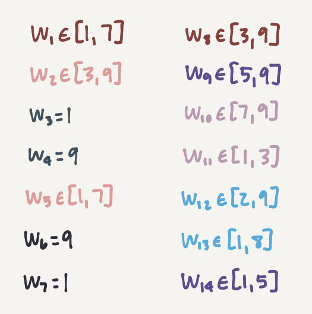

# Day 24: Arithmetic Logic Unit
(I'm writing this on December 25. Chronologically, I solved [Problem 25](https://github.com/Ruminere/aoc-2021/tree/main/Problem25#day-25-sea-cucumber) before this problem.)

This was so, so, *so* much fun.

### December 24
Yesterday, I got bored and had nothing to do (even though I have three projects due after winter break, but that's besides the point). I basically started off by writing a function that would have the program bash through the entire input for all cases. About an hour into programming, though, I realized that I needed to somehow associate a string with a variable. I then caved and decided to use a HashMap of a String and Integer, with the String being one of `w`, `x`, `y`, and `z`, and the Integer being its stored value. But after a few more minutes of coding, I realized that I would have to iterate through 14^9 numbers. That's 20,661,046,784 numbers in total.

I read the directions once again, and I was pretty sure that I'd read everything correctly. Thus, I decided to take inspiration from what I did on [Day 13](https://github.com/Ruminere/aoc-2021/tree/main/Problem13#day-13-transparent-origami) and look at the input. I then wrote the solution logic on paper.

<details>
  <summary>Solution Logic (Spoilers!)</summary>
  I noticed that <code>inp w</code> appeared a couple of times, and so did the next few lines. This prompted me to copy and paste my entire input into a Google Document and start highlighting the differences between each of the different iterations (there's 14 of them). There's only three differences, but these differences are the key to solving the problem. <a href="https://github.com/mrphlip/aoc/blob/master/2021/24.md">This guy explains the logic pretty well.</a>
  <br><br>
  I had gotten the case for the <code>div z 1</code> cases, but not the code for the <code>div z 26</code> cases. I kept getting that the <code>add x</code> number had to be equal to the negative of the <code>add y</code> number (I had <code>w+a+b == w</code>, where <code>a</code> is the <code>add x</code> number and <code>b</code> is the <code>add y</code> number). I was aware, though, that the value of <code>x</code> had to turn out to be 0 for the <code>div z 26</code> cases, since if it were 1, then <code>z</code> cannot ever be 0. There were negative numbers for a reason.
</details>

While I was writing out my solution on paper, I had no idea where I'd gone wrong in my computations. After checking it over, I decided to leave it to today.

### December 25
I eventually rewrote my solution so that it would take iterations of `z` rather than `w+b`, so I now had `z+a == w`. This made a lot more sense, especially since I failed to consider that the `w` in `w+b` represents a different digit from the `w` in `z+a == w`. From there, I figured out the restrictions on each number. Here were my restrictions:



I then used that to find the maximum for Part 1 and the minimum for Part 2.

So for Part 1, I only had to read off the numbers on the right, and for Part 2, I only had to read off the numbers on the left. Note how the colors represent a pair (this makes more sense if you've actually solved the problem).

My verdict for this problem is pretty similar to my verdict from [Problem 13](https://github.com/Ruminere/aoc-2021/tree/main/Problem13#day-13-transparent-origami), so see if you can spot the differences:

> I thought this problem was a better version of Problem 13. It was extremely interesting that the input itself was the key to coming up with solution logic, since I'm pretty used to simply importing the file after looking at the first two lines. I think it would've taken me--no, my poor computer--way, way longer to solve this problem had I not looked at the input and figured the math out. Although I still liked Problem 12, this problem is definitely a top favorite.

In all seriousness, though, this problem could've been either very annoying or very fun. For me, it was fun since I like having to notice stuff and feeling good about noticing them. It reminds me a bit of certain math team problems. But you have to notice quite a bit of stuff for this problem, and for a lot of people, that's bound to be a pretty bad roadblock.

I'm going to upload my joke of a coding solution just because I can. In the future, I might just write up a complete and automated solution based on the method I used to solve this problem. But for now... enjoy my 12 lines of code. (By the way, this would've been 2 lines in Python!)

### Answers
| Part 1 | Part 2 |
| :---: | :---: |
| 79197919993985 | 13191913571211 |

## Part 1
[Magic smoke](https://en.wikipedia.org/wiki/Magic_smoke) starts leaking from the submarine's [arithmetic logic unit](https://en.wikipedia.org/wiki/Arithmetic_logic_unit) (ALU). Without the ability to perform basic arithmetic and logic functions, the submarine can't produce cool patterns with its Christmas lights!

It also can't navigate. Or run the oxygen system.

Don't worry, though - you **probably** have enough oxygen left to give you enough time to build a new ALU.

The ALU is a four-dimensional processing unit: it has integer variables `w`, `x`, `y`, and `z`. These variables all start with the value `0`. The ALU also supports **six instructions**:

- `inp a` - Read an input value and write it to variable `a`.
- `add a b` - Add the value of `a` to the value of `b`, then store the result in variable `a`.
- `mul a b` - Multiply the value of `a` by the value of `b`, then store the result in variable `a`.
- `div a b` - Divide the value of `a` by the value of `b`, truncate the result to an integer, then store the result in variable `a`. (Here, "truncate" means to round the value toward zero.)
- `mod a b` - Divide the value of `a` by the value of `b`, then store the **remainder** in variable `a`. (This is also called the [modulo](https://en.wikipedia.org/wiki/Modulo_operation) operation.)
- `eql a b` - If the value of `a` and `b` are equal, then store the value `1` in variable `a`. Otherwise, store the value `0` in variable `a`.

In all of these instructions, `a` and `b` are placeholders; `a` will always be the variable where the result of the operation is stored (one of `w`, `x`, `y`, or `z`), while `b` can be either a variable or a number. Numbers can be positive or negative, but will always be integers.

The ALU has no **jump** instructions; in an ALU program, every instruction is run exactly once in order from top to bottom. The program halts after the last instruction has finished executing.

(Program authors should be especially cautious; attempting to execute `div` with `b=0` or attempting to execute `mod` with `a<0` or `b<=0` will cause the program to crash and might even damage the ALU. These operations are never intended in any serious ALU program.)

For example, here is an ALU program which takes an input number, negates it, and stores it in `x`:

```
inp x
mul x -1
```

Here is an ALU program which takes two input numbers, then sets `z` to `1` if the second input number is three times larger than the first input number, or sets `z` to `0` otherwise:

```
inp z
inp x
mul z 3
eql z x
```

Here is an ALU program which takes a non-negative integer as input, converts it into binary, and stores the lowest (1's) bit in `z`, the second-lowest (2's) bit in `y`, the third-lowest (4's) bit in `x`, and the fourth-lowest (8's) bit in `w`:

```
inp w
add z w
mod z 2
div w 2
add y w
mod y 2
div w 2
add x w
mod x 2
div w 2
mod w 2
```

Once you have built a replacement ALU, you can install it in the submarine, which will immediately resume what it was doing when the ALU failed: validating the submarine's **model number**. To do this, the ALU will run the MOdel Number Automatic Detector program (MONAD, your puzzle input).

Submarine model numbers are always **fourteen-digit numbers** consisting only of digits `1` through `9`. The digit `0` **cannot** appear in a model number.

When MONAD checks a hypothetical fourteen-digit model number, it uses fourteen separate `inp` instructions, each expecting a **single digit** of the model number in order of most to least significant. (So, to check the model number `13579246899999`, you would give `1` to the first `inp` instruction, `3` to the second `inp` instruction, `5` to the third `inp` instruction, and so on.) This means that when operating MONAD, each input instruction should only ever be given an integer value of at least `1` and at most `9`.

Then, after MONAD has finished running all of its instructions, it will indicate that the model number was **valid** by leaving a `0` in variable `z`. However, if the model number was **invalid**, it will leave some other non-zero value in `z`.

MONAD imposes additional, mysterious restrictions on model numbers, and legend says the last copy of the MONAD documentation was eaten by a [tanuki](https://en.wikipedia.org/wiki/Japanese_raccoon_dog). You'll need to **figure out what MONAD does** some other way.

To enable as many submarine features as possible, find the largest valid fourteen-digit model number that contains no `0` digits. **What is the largest model number accepted by MONAD?**

## Part 2
As the submarine starts booting up things like the [Retro Encabulator](https://www.youtube.com/watch?v=RXJKdh1KZ0w), you realize that maybe you don't need all these submarine features after all.

**What is the smallest model number accepted by MONAD?**
